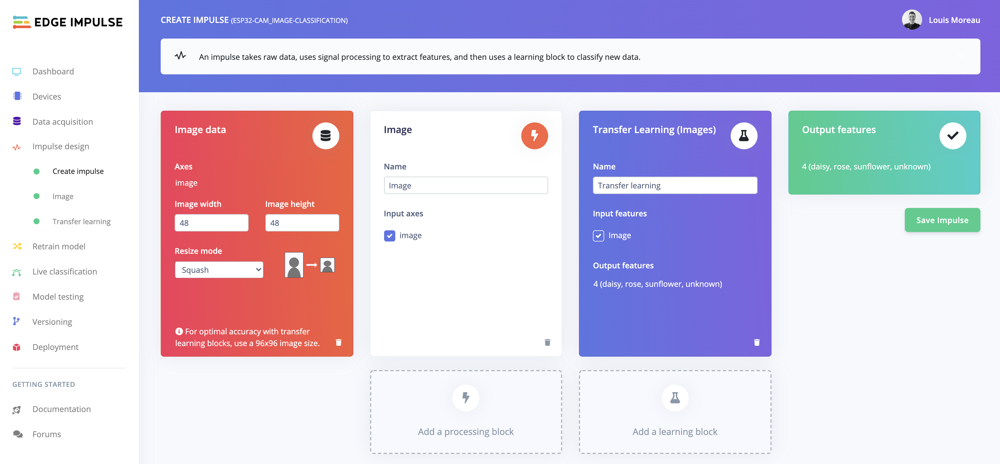
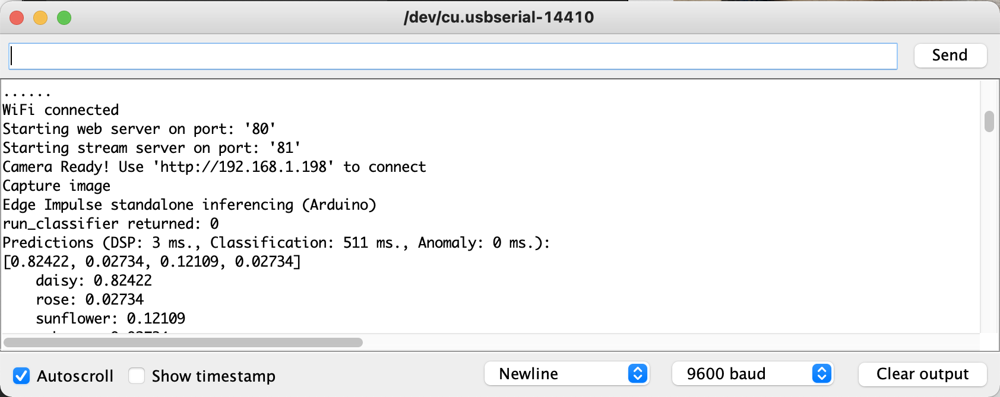

# ESP-EYE and Edge Impulse

How to run custom inference on a ESP-EYE using Edge Impulse. 

### Material


This code has been tested on the ESP-EYE module. It should work the same with the Wrover board or an board that has PSRAM. 

To use this board, please select your board in the Arduino code the following lines:

```
// Select camera model

//#define CAMERA_MODEL_WROVER_KIT // Has PSRAM
#define CAMERA_MODEL_ESP_EYE // Has PSRAM
//#define CAMERA_MODEL_M5STACK_PSRAM // Has PSRAM
//#define CAMERA_MODEL_M5STACK_V2_PSRAM // M5Camera version B Has PSRAM
//#define CAMERA_MODEL_M5STACK_WIDE // Has PSRAM
//#define CAMERA_MODEL_M5STACK_ESP32CAM // No PSRAM
//#define CAMERA_MODEL_AI_THINKER // Has PSRAM
//#define CAMERA_MODEL_TTGO_T_JOURNAL // No PSRAM
```

## Steps

* Create your Image Classification model using [Edge Impulse](https://edgeimpulse.com).

* Due to the board limitations you will need to train your model with 96x96 images and use the MobileNetV1 0.01:*



* Download the Arduino library under the `Deployment` tab in the Edge Impulse studio


### Image Classification Example

* Save the .zip library you have downloaded to [lib/](lib/)
* Add library location to [platformio.ini](platformio.ini)

```ini
lib_deps = lib/<your-project>.zip
```

* Compile and deploy the code to your board

```bash
pio run -t upload
```

* Open the serial monitor and use the provided IP to capture an image and run the inference:




## Resources

- [TinyML ESP32-CAM: Edge Image classification with Edge Impulse](https://www.survivingwithandroid.com/tinyml-esp32-cam-edge-image-classification-with-edge-impulse/) 
- [https://github.com/v12345vtm/esp32-cam-webserver-arduino-simplified-arduino-html](https://github.com/v12345vtm/esp32-cam-webserver-arduino-simplified-arduino-html)
- [ESP32-CAM](https://github.com/edgeimpulse/example-esp32-cam)